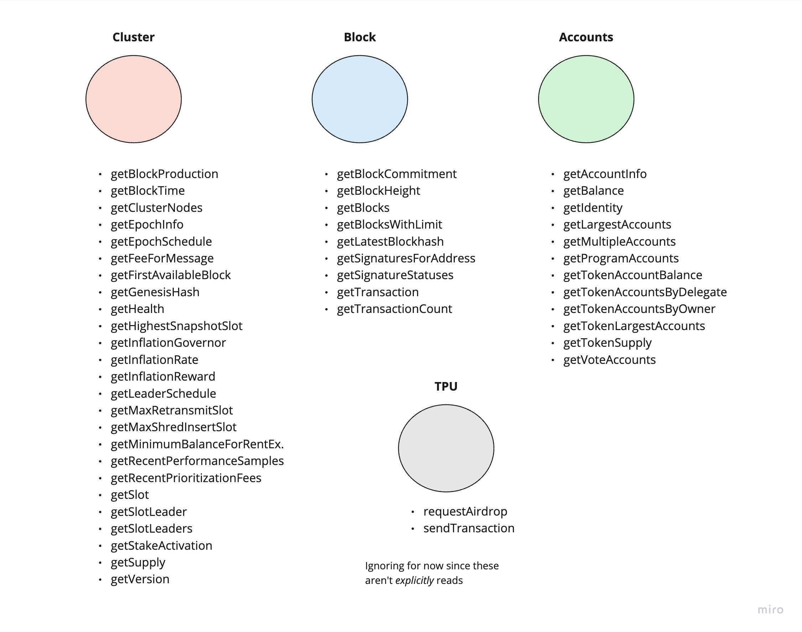
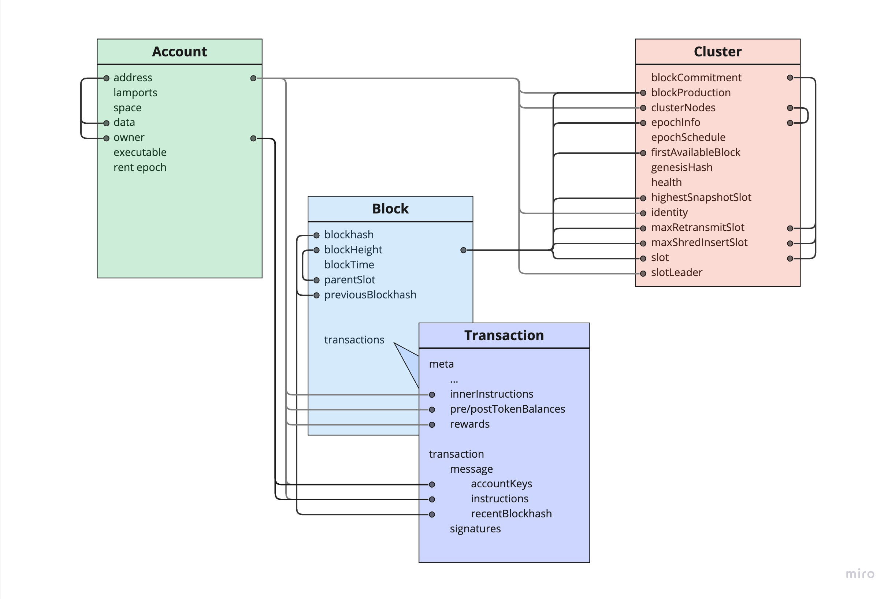

# @solana/rpc-graphql

This package defines a specification of a GraphQL client resolver built on top
of the [Solana JSON-RPC](https://docs.solana.com/api/http).

# Solana Web3 JS GraphQL

GraphQL is a query language for your API, and a server-side runtime for
executing queries using a type system you define for your data.

 [**GraphQL**](https://graphql.org/learn/)

What if you could interact with all of the data on the Solana cluster using
GraphQL queries? What if the server was optimized for things like chaining
requests, caching, and not over-serving?

There's a lot of support for bringing a real, fully-functioning GraphQL RPC
server to Solana, which would enable dApps to build with custom queries that
can retrieve huge amounts of relationally mapped data from the server in just
_one request_.

To demonstrate how this might benefit you, the Solana developer, we propose
this specification for a GraphQL **client-side resolver**. This resolver will
process GraphQL queries and direct the proper RPC calls to the
[Solana JSON-RPC](https://docs.solana.com/api/http)
that you are familiar with today.

With some special magic and a good solid schema, we can make you _feel_ like
you're actually interacting with a real GraphQL RPC server, so you can get a
taste for exactly how much something like this may help your application.
If enough support grows out of use of the resolver, we can turn the concept of
a GraphQL RPC server from a parlor trick into a reality.

## Specification

Data on Solana is widely abundant, as is the case for any blockchain. It makes
perfect sense that we'd want an optimized, reliable and highly-customizable
method for retrieving this data, especially when we want to gather various
information about state that may be related, such as an on-chain prgoram and
all of it's program-owned accounts, famously done through `getProgramAccounts`.

Speaking of the current way of doing things, examining the RPC methods
available through the
[Solana JSON-RPC](https://docs.solana.com/api/http)
is a great way to gauge the kind of data people are requesting to read from the
blockchain.

### Grouping Data on Solana

Consider the below diagram, where we've grouped together the various JSON RPC
methods by which particular component of the Solana network the associated
state pertains to.



You can see that - as per this analysis - we've got three main categories of
data that clients will query from the network.

The nice thing about these "categories" is that they're actually pieces of
state that contain all of the data that each associated RPC method is
responsible for relaying to the client.

For example, a block contains information about transactions, signatures,
stake, and more. So, if you want to get information about any of those things,
you can query a block and pluck out the things you need (with a slick GraphQL
query, of course!).

The same is true for an account. Whether you want to look up an account's
balance, read its data, deserialize its data into some state representation
\- such as a token account - and read _that_ thing's data, or just get a list
of public keys, you can obtain all this information by sifting through the
response payload of an account query.

> Note: The TPU category is ignored for now, since those two RPC methods
> involve _modifying_ state, which we'll cover later. They are categorized
> under TPU since both methods involve forwarding transaction' to the leader's
> Transaction Processing Unit (TPU).

### Laying Down the Base Schema

We can start to think about all of this network data as a graph by examining
the **base schemas** of each category.

```json
// Block
{
    "blockHeight": 428,
    "blockTime": null,
    "blockhash": "3Eq21vXNB5s86c62bVuUfTeaMif1N2kUqRPBmGRJhyTA",
    "parentSlot": 429,
    "previousBlockhash": "mfcyqEXB3DnHXki6KjjmZck6YjmZLvpAByy2fj4nh6B",
    "transactions": [
        {
            "meta": {
                "err": null,
                "fee": 5000,
                "innerInstructions": [],
                "logMessages": [],
                "postBalances": [499998932500, 26858640, 1, 1, 1],
                "postTokenBalances": [],
                "preBalances": [499998937500, 26858640, 1, 1, 1],
                "preTokenBalances": [],
                "rewards": null,
                "status": {
                    "Ok": null
                }
            },
            "transaction": {
                "message": {
                    "accountKeys": [
                        "3UVYmECPPMZSCqWKfENfuoTv51fTDTWicX9xmBD2euKe",
                        "AjozzgE83A3x1sHNUR64hfH7zaEBWeMaFuAN9kQgujrc",
                        "SysvarS1otHashes111111111111111111111111111",
                        "SysvarC1ock11111111111111111111111111111111",
                        "Vote111111111111111111111111111111111111111"
                    ],
                    "header": {
                        "numReadonlySignedAccounts": 0,
                        "numReadonlyUnsignedAccounts": 3,
                        "numRequiredSignatures": 1
                    },
                    "instructions": [
                        {
                            "accounts": [1, 2, 3, 0],
                            "data": "37u9WtQpcm6ULa3WRQHmj49EPs4if7o9f1jSRVZpm2dvihR9C8jY4NqEwXUbLwx15HBSNcP1",
                            "programIdIndex": 4
                        }
                    ],
                    "recentBlockhash": "mfcyqEXB3DnHXki6KjjmZck6YjmZLvpAByy2fj4nh6B"
                },
                "signatures": [
                    "2nBhEBYYvfaAe16UMNqRHre4YNSskvuYgx3M6E4JP1oDYvZEJHvoPzyUidNgNX5r9sTyN1J9UxtbCXy2rqYcuyuv"
                ]
            }
        }
    ]
}
```

```json
// Account
{
    "data": [
        "11116bv5nS2h3y12kD1yUKeMZvGcKLSjQgX6BeV7u1FrjeJcKfsHRTPuR3oZ1EioKtYGiYxpxMG5vpbZLsbcBYBEmZZcMKaSoGx9JZeAuWf",
        "base58"
    ],
    "executable": false,
    "lamports": 1000000000,
    "owner": "11111111111111111111111111111111",
    "rentEpoch": 2,
    "space": 80
}
```

Note there isn't an existing payload that represents the _entire_ cluster,
but you can imagine it looks something like this:

```json
{
      "blockProduction": 5,
      "blockTime": 5,
      "clusterNodes": [
            {
                  // Node
            }
      ],
      "epochInfo": {
            // Epoch Info
      },
      "epochSchedule": {
            // Epoch Schedule
      },

      ...
}
```

You'll notice that some of the data points require inputs - like
`getFeeForMessage`. In fact, even the entire payload for a block requires
the blockhash to query, and the payload for an account requires the address
for the account to query as well.

The relationships between these inputs and outputs are precisely the reason why
representing Solana network data in a graph is maybe not only possible but optimal!

With that being said, consider the schema below:



As you can see, we've successfully created graph edges between data points
returned by the RPC. Now, GraphQL queries can be constructed to chain across
data points, effectively chaining RPC requests together!

### The Resolver

The final piece of this library is what we're dubbing the "resolver". The
resolver is just a name for the concept behind stitching the traditional RPC
API underneath the GraphQL layer, so it _feels_ like you're talking directly
to a GraphQL server, but in reality you're just using GraphQL to direct the
JSON HTTP RPC.

In short, this layer simply routes certain inputs for query parameters to the
proper RPC HTTP methods that must be called to obtain the desired result.
